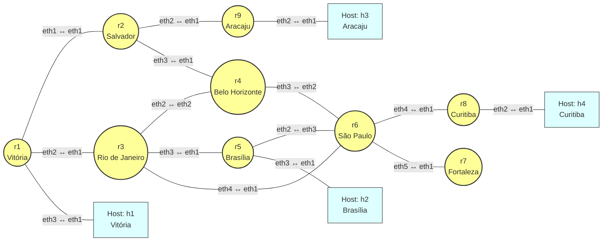

# Documentação da Topologia 4 (Alterada)

## Visão Geral

Este documento detalha a topologia de rede com 9 roteadores (correspondentes a cidades do Brasil) e 4 hosts conectados em pontos específicos, totalizando 13 dispositivos.

### Roteadores e Cidades correspondentes:
- `r1`: Vitória
- `r2`: Salvador
- `r3`: Rio de Janeiro
- `r4`: Belo Horizonte
- `r5`: Brasília
- `r6`: São Paulo
- `r7`: Fortaleza
- `r8`: Curitiba
- `r9`: Aracaju

### Hosts:
- `h1`: Conectado em Vitória (`r1`)
- `h2`: Conectado em Brasília (`r5`)
- `h3`: Conectado em Aracaju (`r9`)
- `h4`: Conectado em Curitiba (`r8`)

## Portas Utilizadas

### Acesso Remoto (Telnet)
As conexões Telnet são direcionadas para a interface VRF de cada dispositivo da seguinte forma:
- Roteadores: Porta `1000X`, onde `X` é o número do roteador. Exemplo: `r1` é porta `10001`, `r9` é porta `10009`.
- Hosts: Porta `2000Y`, onde `Y` é o número do host. Exemplo: `h1` é porta `20001`.

## Diagrama da Topologia (Mermaid)

O diagrama abaixo ilustra as conexões físicas exatas entre as portas dos dispositivos.

