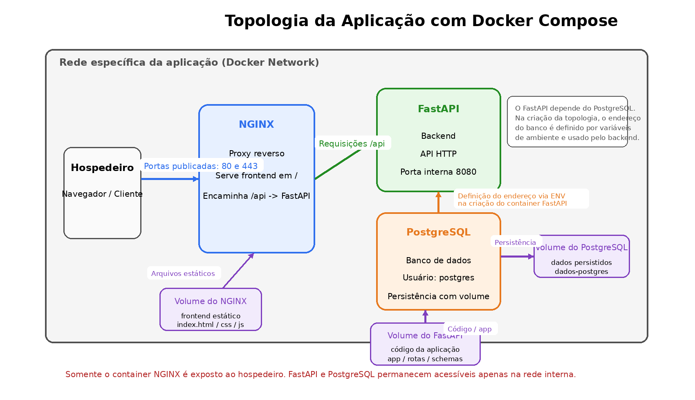

# Atividade Prática: Orquestração de Serviços com Docker Compose

## Disciplina
**Serviços de Redes para Internet**

## Modalidade
Atividade em **dupla** ou **trio**

## Valor
**20,0 pontos**

## Objetivo
Implementar uma aplicação web conteinerizada utilizando **Docker Compose**, composta por múltiplos serviços integrados em uma mesma topologia de rede. A proposta visa explorar a orquestração de containers, comunicação entre serviços, uso de variáveis de ambiente, persistência com volumes, proxy reverso com NGINX e integração entre frontend, backend e banco de dados.

---


## Topologia da aplicação

A arquitetura esperada da solução é composta por três containers principais: **NGINX**, **FastAPI** e **PostgreSQL**.  
O **NGINX** será o único serviço exposto ao hospedeiro, com mapeamento das portas **80** e **443**, servindo o frontend estático na raiz `/` e encaminhando as requisições de `/api` para o backend em **FastAPI**.  
O backend deverá se conectar ao banco **PostgreSQL** por meio da rede interna da aplicação, utilizando variáveis de ambiente para configuração. O banco de dados deverá utilizar volume para persistência.  
Além do volume do **PostgreSQL**, a topologia também poderá utilizar volume no **NGINX** para os arquivos estáticos do frontend e no **FastAPI** para o código da aplicação.  
A inicialização do serviço **FastAPI** depende da disponibilidade inicial do **PostgreSQL**, pois o backend recebe por variáveis de ambiente a definição do endereço do banco no momento da criação da topologia e utiliza essa informação para estabelecer a conexão com o serviço de banco de dados.



---

## Descrição geral da atividade

Cada grupo deverá desenvolver uma aplicação completa com os seguintes componentes:

1. **Backend em FastAPI com Python**
   - Deve disponibilizar uma API HTTP na porta **8080** dentro do container.
   - Deve possuir rotas CRUD relacionadas ao tema do grupo.
   - Exemplos de rotas:
     - `/usuarios`
     - `/produtos`
     - `/clientes`
     - `/agendamentos`
   - A aplicação deverá se conectar a um banco de dados **PostgreSQL**.
   - Os dados de conexão com o banco deverão ser recebidos por **variáveis de ambiente**.

2. **Banco de dados PostgreSQL**
   - Deve ser executado em container próprio.
   - O usuário do banco deverá ser:
     - **postgres**
   - A senha deverá ser:
     - **a matrícula de um dos integrantes do grupo**
   - O banco deverá ser persistido por meio de **volume Docker**.

3. **Servidor NGINX**
   - Deve atuar como **proxy reverso**.
   - Todas as requisições para `/api` devem ser encaminhadas para o container da aplicação FastAPI.
   - A raiz `/` deve servir um **frontend simples estático**, hospedado diretamente no NGINX.
   - Apenas as portas **80 (HTTP)** e **443 (HTTPS)** do hospedeiro poderão ser mapeadas para o container NGINX.

4. **Docker Compose**
   - Toda a topologia deverá ser definida em um arquivo `docker-compose.yml`.
   - Os serviços deverão estar conectados por uma **rede específica da aplicação**.
   - Devem ser utilizados **volumes** para persistência e, quando pertinente, para facilitar o desenvolvimento.

5. **Repositório no GitHub**
   - Cada grupo deverá criar um repositório no GitHub contendo todos os arquivos necessários para execução do projeto.
   - O repositório deverá conter, no mínimo:
     - `Dockerfile`
     - `docker-compose.yml`
     - código do backend FastAPI
     - arquivos de configuração do NGINX
     - frontend estático
     - arquivo `README.md` com instruções de execução

---

## Requisitos obrigatórios

### 1. Topologia mínima esperada
A solução deve possuir, no mínimo, os seguintes containers:

- `nginx`
- `fastapi`
- `postgres`

### 2. Backend FastAPI
A API deverá:

- depender do início do serviço PostgreSQL;

- rodar em container próprio;
- escutar na porta **8080**;
- implementar **CRUD completo** do tema proposto;
- possuir pelo menos **2 entidades** relacionadas ao domínio do grupo;
- acessar o PostgreSQL via variáveis de ambiente;
- responder corretamente às requisições vindas do NGINX por `/api`.

### 3. NGINX
O NGINX deverá:

- servir os arquivos estáticos do frontend na raiz `/`;
- encaminhar requisições de `/api` para o FastAPI;
- ser o **único serviço exposto ao hospedeiro**;
- mapear apenas:
  - `80:80`
  - `443:443`

### 4. PostgreSQL
O serviço do banco deverá:

- utilizar imagem oficial do PostgreSQL;
- usar usuário `postgres`;
- usar senha definida como a matrícula de um integrante;
- persistir dados em volume;
- estar acessível apenas pela rede interna da aplicação.

### 5. Docker Compose
O arquivo `docker-compose.yml` deverá:

- prever a dependência de inicialização entre FastAPI e PostgreSQL;

- definir todos os serviços;
- criar uma **rede própria** para a aplicação;
- definir **volumes**;
- utilizar variáveis de ambiente;
- permitir levantar toda a topologia com um único comando.

### 6. Frontend simples
O frontend deve:

- ser uma interface simples em HTML/CSS/JavaScript;
- estar hospedado na raiz do NGINX;
- consumir a API via `/api`;
- permitir ao menos:
  - listar registros;
  - cadastrar registros;
  - editar registros;
  - remover registros.

---

## Temas dos 8 grupos

Cada grupo deverá implementar o CRUD de acordo com um dos temas abaixo.

### Grupo 1 — Sistema de Cadastro de Usuários e Perfis
**Entidades sugeridas:**
- usuários
- perfis

**Exemplos de rotas:**
- `GET /usuarios`
- `POST /usuarios`
- `PUT /usuarios/{id}`
- `DELETE /usuarios/{id}`
- `GET /perfis`

**Frontend:**
- tela de cadastro e listagem de usuários.

---

### Grupo 2 — Catálogo de Produtos e Categorias
**Entidades sugeridas:**
- produtos
- categorias

**Exemplos de rotas:**
- `GET /produtos`
- `POST /produtos`
- `PUT /produtos/{id}`
- `DELETE /produtos/{id}`
- `GET /categorias`

**Frontend:**
- página de produtos com formulário de cadastro.

---

### Grupo 3 — Sistema de Biblioteca
**Entidades sugeridas:**
- livros
- autores

**Exemplos de rotas:**
- `GET /livros`
- `POST /livros`
- `PUT /livros/{id}`
- `DELETE /livros/{id}`
- `GET /autores`

**Frontend:**
- tela para cadastrar, listar e remover livros.

---

### Grupo 4 — Controle de Alunos e Cursos
**Entidades sugeridas:**
- alunos
- cursos

**Exemplos de rotas:**
- `GET /alunos`
- `POST /alunos`
- `PUT /alunos/{id}`
- `DELETE /alunos/{id}`
- `GET /cursos`

**Frontend:**
- tela simples para gerenciar alunos e cursos.

---

### Grupo 5 — Sistema de Agendamentos
**Entidades sugeridas:**
- clientes
- agendamentos

**Exemplos de rotas:**
- `GET /clientes`
- `POST /clientes`
- `GET /agendamentos`
- `POST /agendamentos`
- `DELETE /agendamentos/{id}`

**Frontend:**
- agenda simples para cadastro de clientes e horários.

---

### Grupo 6 — Controle de Pedidos
**Entidades sugeridas:**
- pedidos
- itens_pedido

**Exemplos de rotas:**
- `GET /pedidos`
- `POST /pedidos`
- `PUT /pedidos/{id}`
- `DELETE /pedidos/{id}`

**Frontend:**
- página de criação e consulta de pedidos.

---

### Grupo 7 — Sistema de Filmes e Avaliações
**Entidades sugeridas:**
- filmes
- avaliacoes

**Exemplos de rotas:**
- `GET /filmes`
- `POST /filmes`
- `PUT /filmes/{id}`
- `DELETE /filmes/{id}`
- `GET /avaliacoes`

**Frontend:**
- cadastro de filmes e avaliações simples.

---

### Grupo 8 — Controle de Tarefas e Projetos
**Entidades sugeridas:**
- tarefas
- projetos

**Exemplos de rotas:**
- `GET /tarefas`
- `POST /tarefas`
- `PUT /tarefas/{id}`
- `DELETE /tarefas/{id}`
- `GET /projetos`

**Frontend:**
- tela simples para organizar tarefas por projeto.

---

## Estrutura mínima esperada do projeto

```text
nome-do-projeto/
├── docker-compose.yml
├── README.md
├── .env
├── backend/
│   ├── Dockerfile
│   ├── requirements.txt
│   ├── app/
│   │   ├── main.py
│   │   ├── models.py
│   │   ├── database.py
│   │   ├── routes/
│   │   └── schemas/
├── nginx/
│   ├── Dockerfile (opcional)
│   ├── nginx.conf
│   └── html/
│       ├── index.html
│       ├── style.css
│       └── script.js
└── postgres/
```

---

## Exigências técnicas específicas

### Docker
- uso de `Dockerfile` para o backend;
- uso de `docker-compose.yml` para integração dos serviços;
- uso de **rede customizada**;
- uso de **volume para persistência do PostgreSQL**;
- uso de variáveis de ambiente;
- containers nomeados adequadamente.

### FastAPI
- API funcional com CRUD;
- organização mínima do código;
- tratamento básico de erros;
- conexão com PostgreSQL;
- documentação automática acessível via FastAPI é desejável.

### NGINX
- proxy reverso funcionando corretamente;
- frontend servido na raiz;
- `/api` redirecionando para o backend.

### GitHub
- repositório organizado;
- commits identificáveis;
- `README.md` contendo:
  - descrição do projeto;
  - integrantes;
  - tema do grupo;
  - instruções para subir a aplicação;
  - exemplos de uso.

---

## Entrega

Cada grupo deverá entregar:

1. **Link do repositório GitHub**
2. **Arquivo `README.md`** com instruções de execução
3. **Demonstração funcional em sala** ou em vídeo, caso solicitado
4. Evidência de que a aplicação sobe com:

```bash
docker compose up --build
```

---

## Critérios de avaliação (20,0 pontos)

### 1. Organização da topologia com Docker Compose — 4,0 pontos
- 1,0: definição correta dos serviços
- 1,0: uso correto de rede específica
- 1,0: uso correto de volumes
- 1,0: uso correto de variáveis de ambiente

### 2. Backend em FastAPI — 5,0 pontos
- 2,0: implementação do CRUD
- 1,0: rotas coerentes com o tema
- 1,0: integração com PostgreSQL
- 1,0: organização e funcionamento do backend

### 3. Banco de dados PostgreSQL — 3,0 pontos
- 1,0: configuração correta do serviço
- 1,0: autenticação com usuário/senha exigidos
- 1,0: persistência dos dados com volume

### 4. NGINX e proxy reverso — 3,0 pontos
- 1,5: proxy reverso `/api` funcionando corretamente
- 1,5: frontend servido corretamente na raiz

### 5. Frontend simples integrado — 3,0 pontos
- 1,0: listagem de dados
- 1,0: formulário de cadastro/edição
- 1,0: integração com a API

### 6. Repositório e documentação — 2,0 pontos
- 1,0: organização do GitHub
- 1,0: clareza do `README.md`

---

## Descontos possíveis
Poderão ocorrer descontos nos seguintes casos:

- ausência de volume persistente;
- ausência de rede específica;
- senha do banco diferente da especificada;
- portas do FastAPI ou PostgreSQL expostas diretamente no hospedeiro;
- frontend não hospedado no NGINX;
- proxy reverso não funcionando;
- projeto não sobe com `docker compose up --build`;
- repositório incompleto.

---

## Sugestão de desafio extra
Como diferencial, o grupo poderá implementar um ou mais dos itens abaixo:

- uso de HTTPS com certificado local;
- paginação nas rotas;
- documentação melhorada da API;
- uso de `.env`;
- healthcheck nos containers;
- tela frontend mais elaborada;
- uso de migrations.

Esses itens não substituem os requisitos obrigatórios, mas podem ser considerados positivamente em casos limítrofes de avaliação.

---
